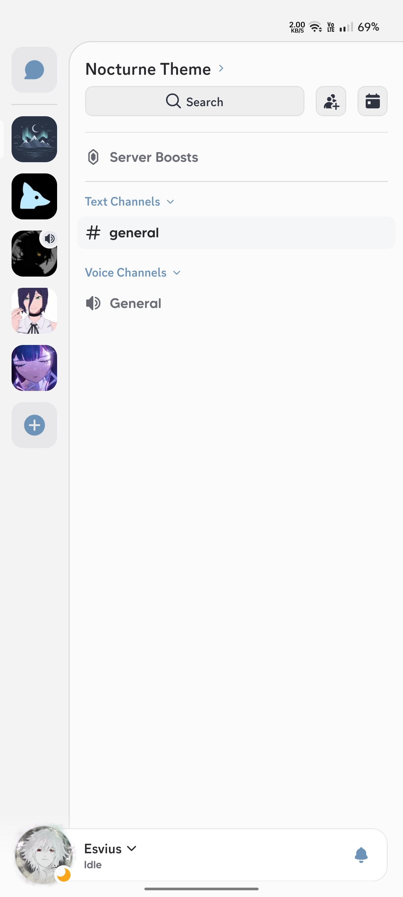
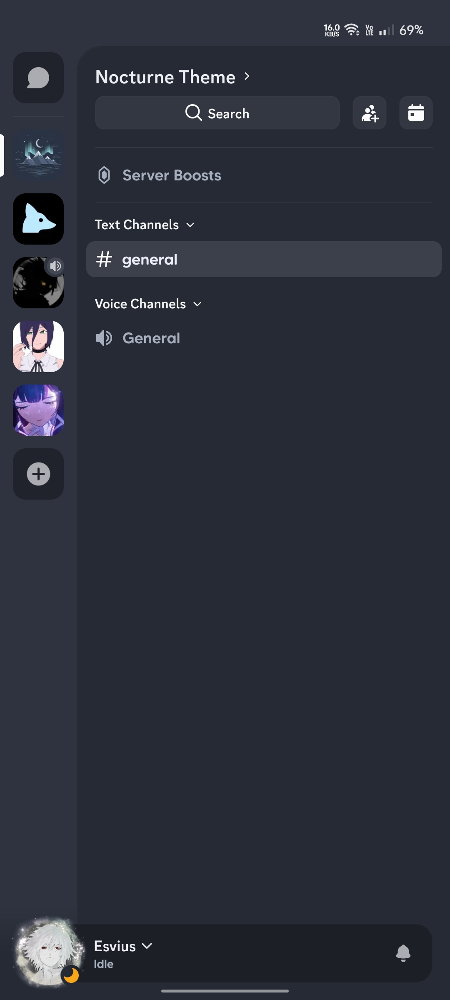
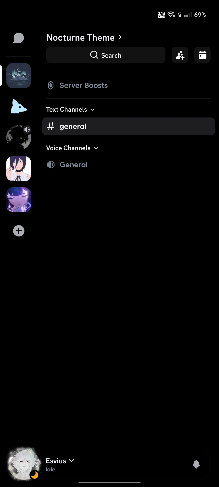

<h3 align="center">
	Nocturne for <a href="https://discord.gg/WehrvxdF27">Discord</a>
</h3>

<p align="center">
    <a href="https://github.com/esvius/nocturne/stargazers"></a>
    <a href="https://github.com/esvius/nocturne/issues"></a>
    <a href="https://github.com/esvius/nocturne/contributors"></a>
</p>


## Previews

<table align="center">
  <tr>
    <th align="center" width="80">☀️ <b>Light</b></th>
    <th align="center" width="80">🌊 <b>Navy</b></th>
    <th align="center" width="80">🖤 <b>Obsidian</b></th>
  </tr>
  <tr>
    <td align="center"></td>
    <td align="center"></td>
    <td align="center"></td>
  </tr>
</table>

## Usage

### Kettu / Rain / etc.

1. Copy raw link your preferred flavour:

Light
```bash
https://raw.githubusercontent.com/esvius/nocturne/refs/heads/main/themes/light.theme.json
```

Navy
```bash
https://raw.githubusercontent.com/esvius/nocturne/refs/heads/main/themes/navy.theme.json
```

Obsidian
```bash
https://raw.githubusercontent.com/esvius/nocturne/refs/heads/main/themes/obsidian.theme.json
```

2. Open your Kettu / Rain etc. and go to themes and install with source URL.

3. Enable the theme and enjoy!

## 🙋 FAQ 

> [!CAUTION]
> **Using third party clients is against the ToS. We are not responsible for anything that might happen to your account by using third party clients. Use at your own risk.**

## 💝 Thanks to

- Everyone who contributes ideas, bug reports, and pull requests to Nocturne!

&nbsp;

<p align="center">Copyright &copy; 2026-present <a href="https://github.com/esvius" target="_blank">esvius</a></p>
<p align="center"><a href="https://github.com/esvius/nocturne/blob/main/LICENSE"></a></p>
